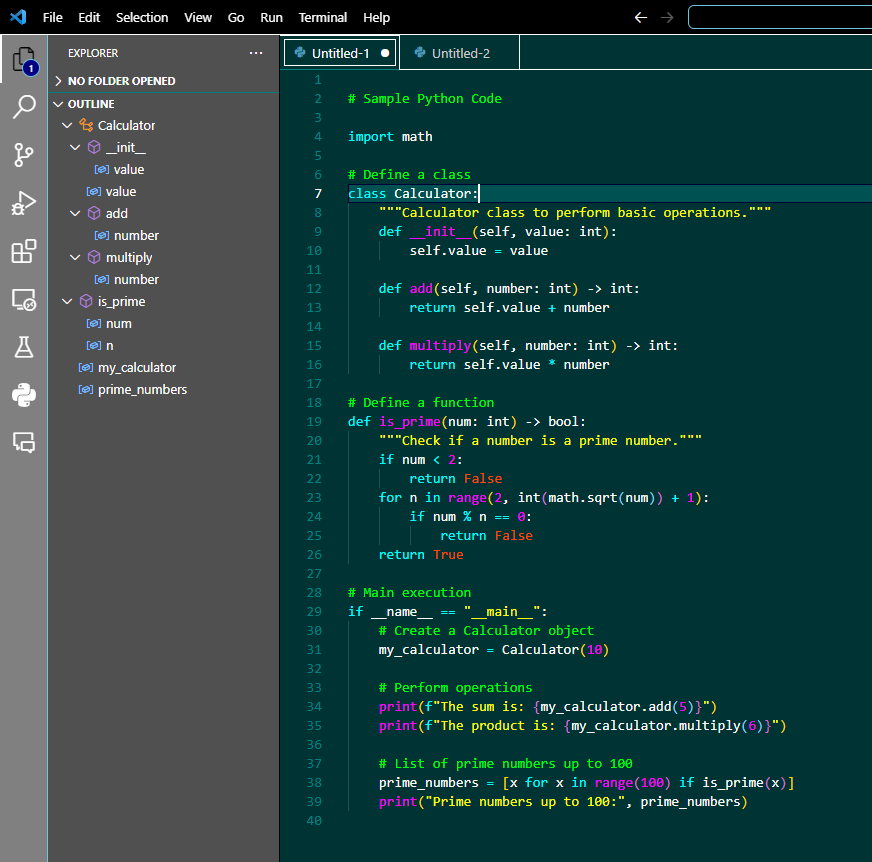
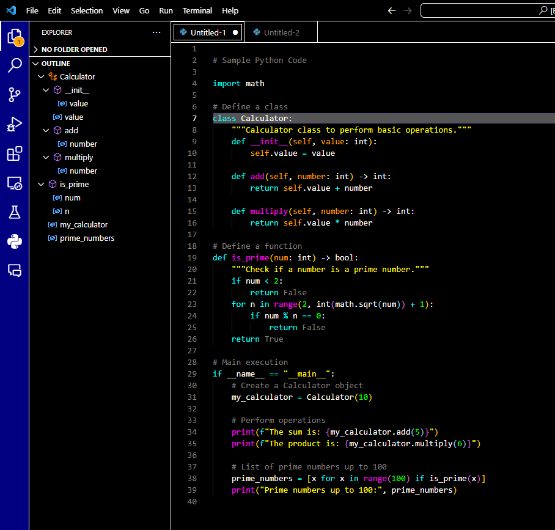
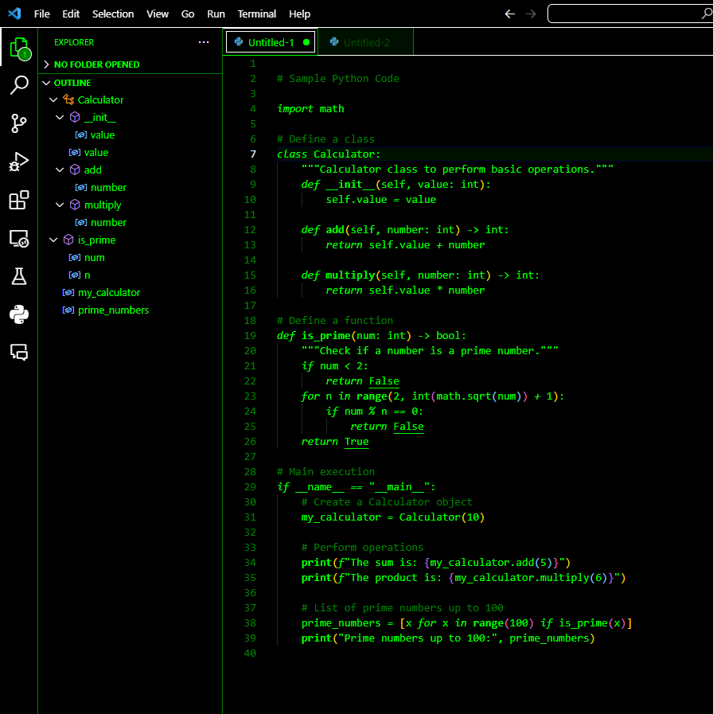
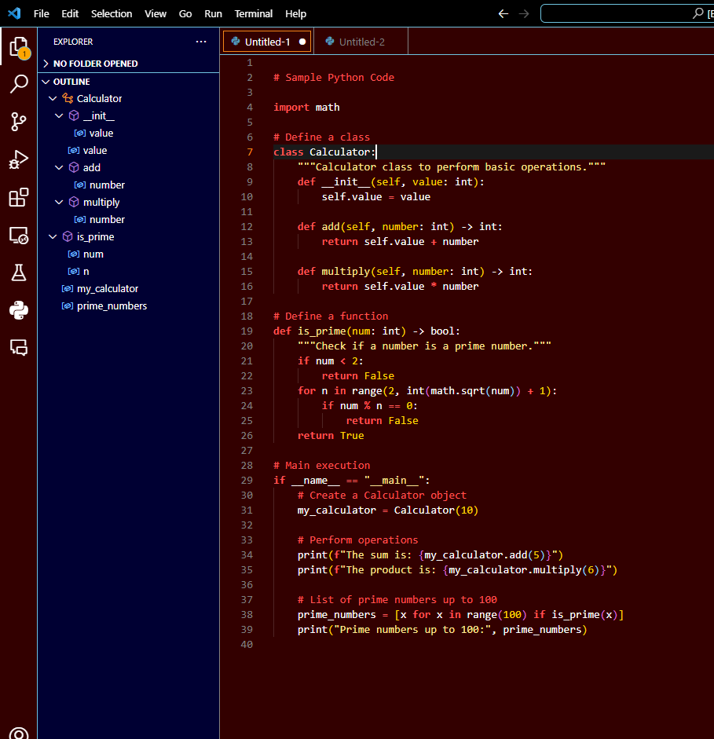
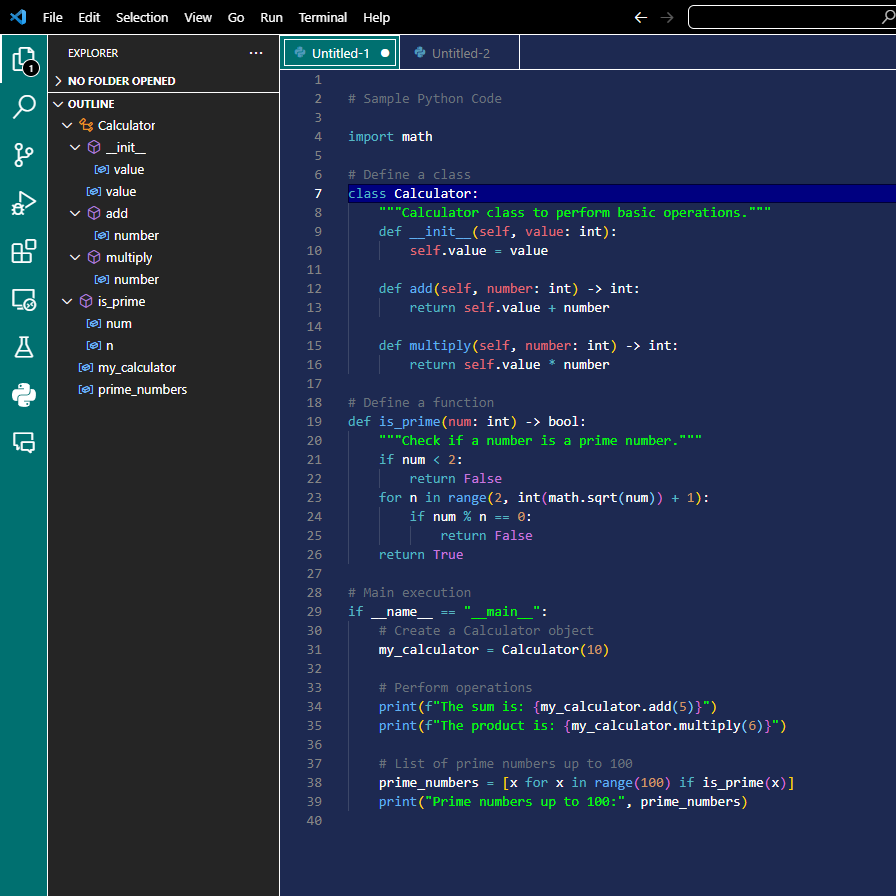

# Oldschool Theme

A high-contrast theme collection inspired by classic programming environments like QBasic and MS-DOS. Designed to satisfy your nostalgia and allow for productivity, Oldschool Theme now comes with special editions that pay homage to the iconic Windows 95 interface, old terminals and even the unforgettable Doom.

Available in eleven options:

- Windows 95 (Very nostalgic theme)
- Windows 95 (Somewhat nostalgic theme)
- Darker QBasic (Ericson's Classic)
- Terminal Theme (Green)
- Doom Edition
- QBasic
- Olive
- Gray
- Purple
- Maroon
- Evil
- Teal
- Green

## Important Note:

Due to the loss of access to the original account on the VSCode marketplace, I am releasing this new separate extension. It will continue to receive updates and support. Thank you to all the users who have enjoyed the original Oldschool Theme over the years — your support means the world, and I hope you'll enjoy these new editions as well.

For any issues, requests, or contributions, please visit the [repository](https://github.com/EricsonWillians/oldschool-theme).

### Windows 95 (Very nostalgic theme) Screenshot:

### Windows 95 (Somewhat nostalgic theme) Screenshot:

### Darker QBasic Screenshot:

### Terminal Green Screenshot:

### Doom Edition Screenshot:

### QBasic Light Screenshot:

